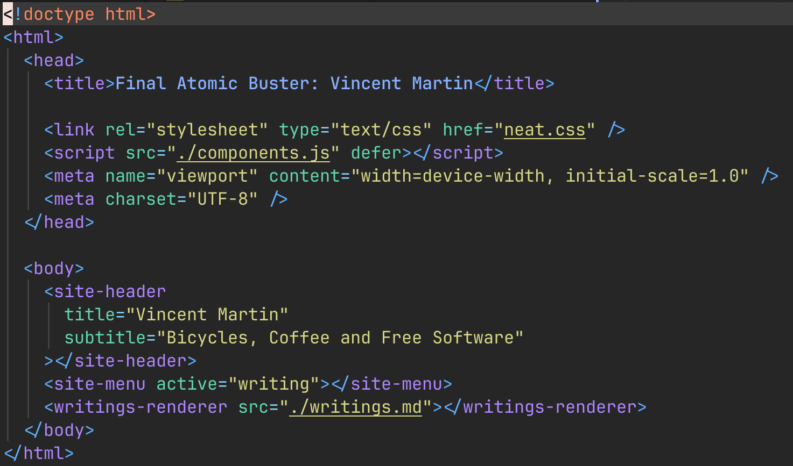

Title: Welcome!
Date: 12/07/2025

Welcome to my new website. Previously I created www.finalatomicbuster.net using the Hugo static website generator. Hugo is a pretty cool project and I liked it. However, I came to realize that I only update this website every year or so, and every time I came back to it to make a change I managed to forget how to use Hugo. Additionally I realized I don't want to have to deal with dependencies over the years. My website is so simple that there is no reason why it can't just be plain old HTML and some JS to help reduce some repetition.

You may ask, what do you mean by reduce repetition?  I realized that this site had a few different html files and I didn't want to have to make changes to each file if I wanted to change items that repeat on them.  I thought to myself it would be nice to have "components" in a super simple way.  I remembered that HTML implemented web components at some point, so I thought, these sound perfect!

Hence the introduction of two components on this site.  The first component is <site-header> which renders a Title and a Subtitle, the second is <site-menu> which allows you configure items that show up in the site menu, currently I have only 'Home', 'Resume' and 'Writings' enabled.  Finally, I have <writings-renderer> which parses through a .md file containing Blog entries separated by a series of three '-' and renders their title, date and content.

Currently it is very simple and can only render paragraphs and images.  I will add inline links at some point.  Additionally the images that it renders are not even able to be inline, they can only be between two '
' items.  Check out an image here as an example of actually rendering an image, and also as a display of how these items are used in html.

I realize using web components here might not even make much sense, but I couldn't help myself.  I just wanted to do it anyway :)

Things I would like to add to this small render component.
* Allow things like bold, italic and headings.
* Allow inline links and images
* Fix renderer so I can escape items that might be used by it that I'd like to render instead of act on.

Thanks for stopping by!
